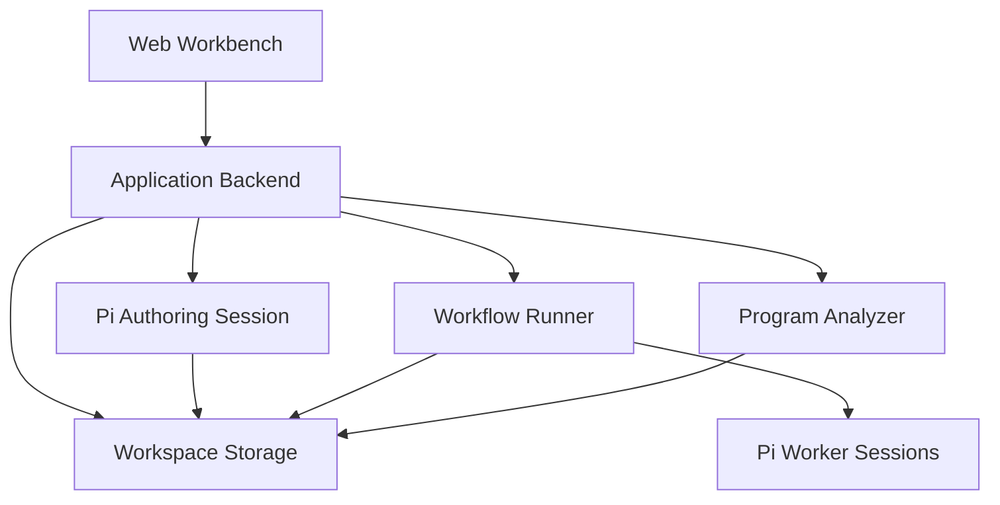
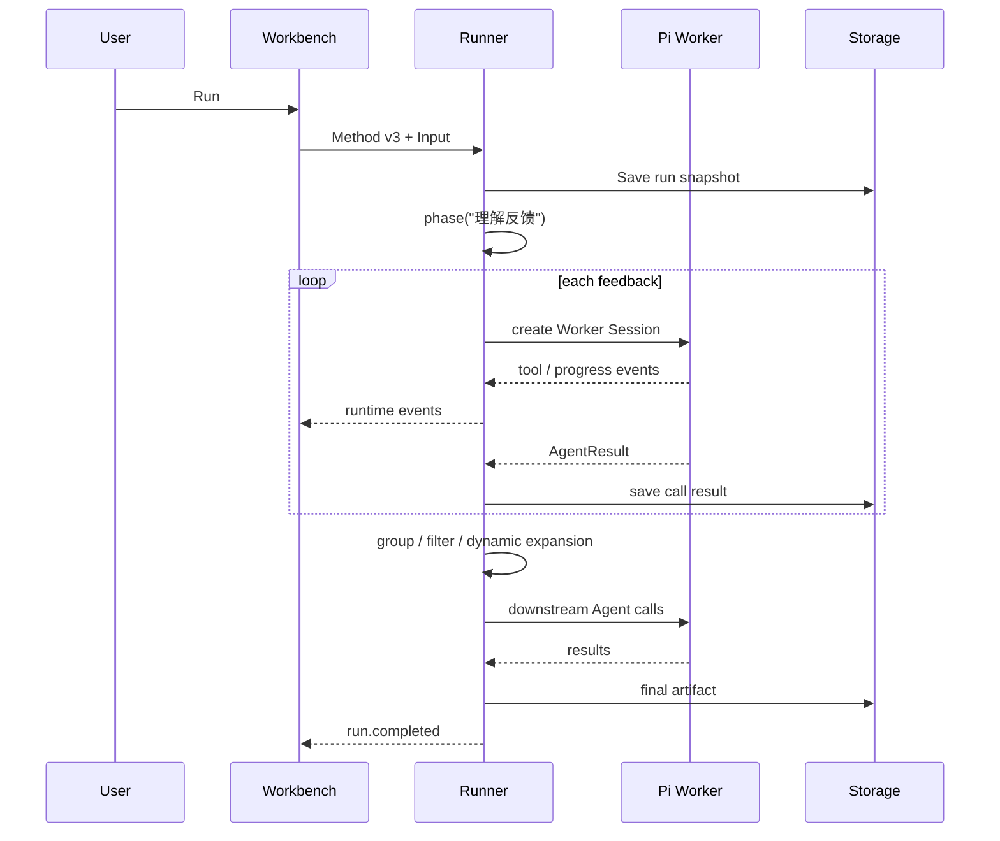
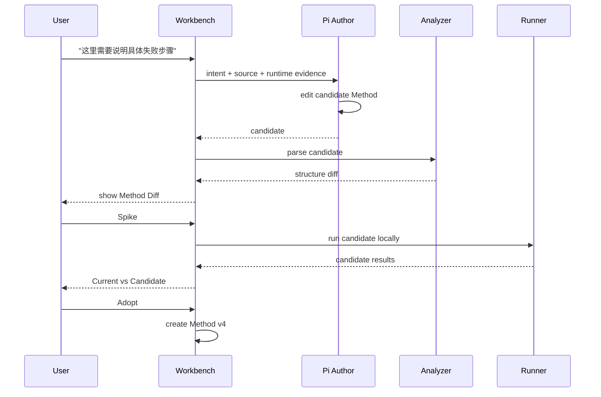
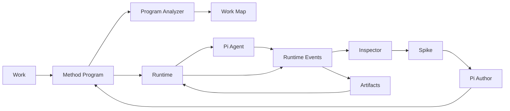

# Dynamic Workflow Workbench

**面向长尾工作的程序化协调、可观察执行与人工局部试验**

版本：v2  
日期：2026-09-19  
Harness：**Pi Agent**  
状态：产品 / 技术设计稿

---

# 0. 设计结论

Dynamic Workflow Workbench 面向这样一类工作：

> 用户有一件真实、复杂、此前没有专门 Workflow 的长尾任务。Agent 根据当前任务即时形成一份求解程序；程序协调多个局部 Agent 和普通代码完成工作；人在工作过程中能够理解当前做法、查看真实执行、拿真实材料局部试验、修改做法，并把有效改进接回整件事情。

产品的核心并不是 Workflow Builder。

产品的核心闭环是：

```text
给出目标与材料
      ↓
Agent 形成当前做法
      ↓
程序开始解决真实问题
      ↓
人看见实际工作和结果
      ↓
发现某个局部不理想
      ↓
拿真实材料 Spike
      ↓
修改实际执行程序
      ↓
比较 Current / Candidate
      ↓
采用改法 / 沿用已有产物
      ↓
继续完成剩余工作
```

第一版必须同时具备四项能力：

**Visualize / Spike / Debug / Modify**

它们不能被推迟成 Workflow Runtime 完成后的外围功能。这继承原设计对第一版产品完整性的要求。

---

# 1. 产品定位

## 1.1 解决的问题

传统 Workflow 的基本假设是：

```text
先知道完整流程
→ 定义节点
→ 定义连接
→ 配置输入输出
→ 执行
```

Dynamic Workflow 面向的任务通常没有这样的前提。

用户往往只知道：

- 想完成什么；
- 手上有什么材料；
- 对结果有什么粗略要求；
- 做到中途以后，才会发现哪些地方需要进一步调查；
- 看见局部结果以后，才知道方法是否合理。

因此系统允许一开始只有：

```text
Goal
Materials
Context
```

随后由 Agent 为当前任务生成一份普通 TypeScript / JavaScript 求解程序。

程序可以使用：

```text
普通顺序
if / else
loop
filter
function
parallel
pipeline
agent call
```

新结果可以决定下一步要做多少工作。

原设计已经明确：程序是真正的协调依据，局部 Agent 负责具体工作，主 Agent 不需要在每次局部调用结束后重新决定已经写进程序的下一步。

---

# 2. 产品原则

## 2.1 程序是执行事实

Workflow Method 是一份真正执行的普通程序。

Visual View、Work Map、结构说明、运行轨迹全部从：

```text
Method Program
+
Runtime Events
```

生成。

系统不存在另外一份需要长期与程序同步的 Semantic Graph。

因此：

```text
修改 Visual
        ↓
实际修改程序
        ↓
重新解析
        ↓
重新生成 Visual
```

而不会出现：

```text
Visual Graph A
Runtime Program B
```

两个事实源。

原设计对此已有明确约束。

---

## 2.2 完成事情优先

第一版判断产品是否成立的标准是：

> 面对以前没有专门适配过的真实工作，系统是否能开始产生有价值的结果；用户发现局部问题以后，能否低成本纠正，而不用重新开始整个任务。

因此：

- Schema 按局部实际需要产生；
- 验证按实际问题增加；
- checkpoint 按真实损失增加；
- 权限边界按实际执行环境增加；
- 不先建设完整 Workflow Governance Platform。

---

## 2.3 模糊存在于工作层，具体存在于执行层

用户可以说：

> “先了解这些反馈，再看看哪些问题值得深入。”

这是合理的工作表达。

真正开始执行时，系统会产生具体程序：

```ts
const notes = await r.pipeline(...)

const themes = await r.agent(...)

const unclear = themes.filter(x => x.needsMore)

const research = await r.pipeline(unclear, ...)
```

**工作可以模糊，已经启动的一次执行必须有具体做法。**

---

## 2.4 人修改的是“做法”

用户不应该被迫理解：

```text
node
edge
state reducer
checkpoint
schema
```

用户表达：

> “这里分析得太泛了，要说明用户到底在哪一步失败。”

系统定位对应 Method Region / Call Site，让 Pi Agent 修改实际程序。

---

## 2.5 运行事实高于模型解释

结构图可以包含 Agent 给出的解释，但必须明显区分：

```text
Program-derived
Runtime-observed
Agent-explained
```

运行状态永远来自实际事件。

不会因为 Agent 说：

> “这一阶段已经完成。”

就把它显示为完成。

---

# 3. 第一版不是什么

第一版明确不建设：

| 不建设 | 原因 |
|---|---|
| 通用业务 Schema 平台 | 长尾工作没有稳定统一 Schema |
| 完整 Capability Ontology | 会提前固化工作世界 |
| 任意 JS ↔ 任意画布无损转换 | 成本极高且偏离核心闭环 |
| 分布式 Durable Workflow Engine | 当前连续工作模型不需要 |
| 自动 Prompt Optimizer | 人工 Spike 足以验证核心价值 |
| 多角色 Agent 组织框架 | 当前 Method 程序已经承担协调 |
| 一套新的 Agent Harness | **直接复用 Pi Agent** |
| 自动严格权限治理平台 | 按执行场景逐步增加 |

原设计同样把这些能力排除在第一版交付之外。

---

# 4. 核心用户旅程

整个产品首先围绕八个用户故事设计。

## Story 1 — 把工作交进来

> 我有一件事情需要完成，我希望给出目标和材料以后系统直接开始形成做法，而不是让我设计 Workflow。

输入：

```text
Goal
Materials
Additional context
```

例如：

```text
目标：
分析这 50 条客户反馈，
找出真正影响体验的问题，
形成能够推进产品改进的建议。

材料：
customer-feedback.csv
product-background.pdf
```

系统创建：

```text
Work
+
Method v1
```

---

## Story 2 — 在真正大量执行前先看懂做法

用户想知道：

```text
准备怎么做？
哪里会并行？
哪里根据结果动态展开？
什么地方使用 Agent？
哪些数据流向哪里？
```

用户看到的是 Work Map，而不是底层 AST。

---

## Story 3 — 先拿几条真实材料试试

例如：

```text
反馈 #8
反馈 #12
反馈 #31
```

用户点击：

> 先用这三条试一下

系统创建：

```text
Spike
```

而不要求用户先构造测试数据。

这继承原设计的 Spike 定义。

---

## Story 4 — 看实际运行发生了什么

用户看到：

```text
理解反馈

12 / 50 completed
2 running
36 waiting

#06 ✓
#07 ✓
#08 ● running
#09 ○ waiting
```

如果下游任务数量由执行结果决定：

```text
补充调查
? themes
```

运行发现三个以后才变为：

```text
补充调查
3 themes
```

---

## Story 5 — 从坏结果定位原因

用户点击：

```text
readOne / feedback #8
```

Inspector 展示：

```text
Input
Task
Result
Tools
Public execution trace
Related source
```

从“这个结果不好”一路找到“实际应该改哪个地方”。

原设计中 `siteId → callId → input/result/source` 就是为了支撑这一过程。

---

## Story 6 — 用自然语言修改这个局部

例如：

> 保留客户原话，并说明失败到底发生在哪一步，出现了什么现象。

系统告诉用户：

```text
即将修改：

readOne()

影响：
后续所有 readOne 调用

当前 Method：
v3

候选 Method：
candidate-17
```

然后：

```text
[先试]
[查看代码]
[采用]
```

---

## Story 7 — 用相同样本比较 Current / Candidate

Spike Workspace：

```text
                    CURRENT       CANDIDATE

feedback #8           原结果          新结果
feedback #12          原结果          新结果
feedback #31          原结果          新结果
```

用户自己判断：

```text
✓ 更有用
≈ 差不多
✕ 更差
```

不需要第一版自动构造评价函数。

---

## Story 8 — 用改好的方法继续完成事情

例如：

```text
总计 50 条

旧方法已完成 12
├─ 10 条满意 → 沿用
└─ 2 条不满意 → 重做

剩余 38 条
→ 使用新 Method
```

随后：

```text
重新 group
→ research
→ final report
```

这里必须区分：

```text
Adopt Method
```

与：

```text
Keep Artifact
```

两者完全不同。原设计已经明确强调这一点。

---

# 5. 产品核心对象

系统内部只保留真正服务上述用户故事的对象。

## 5.1 Work

代表用户正在完成的一件事情。

```ts
interface Work {
  id: string
  title: string
  goal: string
  materials: MaterialRef[]

  currentMethodVersion: string

  createdAt: string
  updatedAt: string
}
```

Work 是产品最上层对象。

用户打开应用首先看到的是 Work，而不是 Workflow Definition。

---

# 6. Method

Method 是：

> 当前系统用来解决这件工作的程序。

例如：

```text
method/
  v1.ts
  v2.ts
  v3.ts
  current -> v3
```

每次正式执行绑定一个不可变 MethodVersion。

```ts
interface MethodVersion {
  id: string
  workId: string

  parentVersion?: string

  sourceFile: string
  createdBy: "initial" | "human-patch" | "agent-patch"

  createdAt: string
}
```

运行已经开始以后，即使用户修改当前 Method：

```text
Run #17 → Method v3
```

仍然继续对应 v3。

新运行：

```text
Run #18 → Method v4
```

---

# 7. Region / Site / Instance

这是整个可视化最关键的对象层级。

```text
Work
  ↓
Region
  ↓
Call Site
  ↓
Runtime Instance
```

## Region

人类能够理解的一段工作，例如：

```text
理解反馈
归并主题
补充调查
形成建议
```

Region 主要来自：

```ts
r.phase(...)
```

以及程序结构分析。

---

## Site

Site 是程序中的一个可定位执行位置。

例如：

```ts
r.agent("read-one", ...)
```

对应一个 Site。

Site 不等于一次实际 Agent 调用。

---

## Instance / Call

如果 readOne 被调用 50 次：

```text
Site: read-one
```

会有：

```text
Call #1
Call #2
...
Call #50
```

因此：

```text
Site
  └── Runtime Instances[]
```

而不是：

```text
Node × 50
```

---

# 8. Artifact

Artifact 是执行产生的可继续使用的结果。

例如：

```text
一条反馈分析
主题列表
调查文档
最终报告
脚本生成的文件
```

```ts
interface Artifact {
  id: string

  runId: string
  callId?: string

  type: string

  path?: string
  value?: unknown

  methodVersion: string
  inputFingerprint?: string
}
```

Artifact 是否被继续沿用，由用户或后续程序决定。

---

# 9. Spike

Spike 是一个真实的局部实验。

```ts
interface Spike {
  id: string
  workId: string

  baseMethodVersion: string
  candidateMethodVersion?: string

  targetSiteId: string

  samples: SpikeSample[]

  includeDownstream: boolean

  status: string
}
```

Spike 自己是一等对象，而不是某个 Run 上的一个参数。

---

# 10. Correction

Correction 保存人的判断。

例如：

```text
“这里太泛”
“没有保留原话”
“#12 这版更好”
“这次结果沿用”
```

Correction 不必立即转换成正式 Schema。

它的用途首先是：

```text
用户回来以后知道自己为什么改过这里。
```

---

# 11. 整体系统架构



对应职责：

```text
Web Workbench
    人看、选、试、改、继续

Application Backend
    Work 生命周期
    Method 生命周期
    Spike 操作
    Runner 生命周期
    SSE

Pi Authoring Session
    编写 / 修改 Method

Runner
    执行 Method
    parallel / pipeline
    记录运行事实

Pi Worker Sessions
    完成一个具体局部 Agent 工作

Program Analyzer
    Method → Work Map
    Source mapping

Workspace Storage
    程序
    材料
    Artifact
    Run
    Event
    Correction
```

---

# 12. Harness：Pi Agent

本稿固定选择：

```text
@earendil-works/pi-coding-agent
```

作为 Agent Harness。

截至本稿日期，Pi 官方 SDK 直接支持 `createAgentSession()`、事件订阅、工具配置、Session 管理、`steer()`、`followUp()` 和 `abort()`；官方也明确将“嵌入自己的应用”“构建自定义 UI”“自动化 pipeline”列为 SDK 使用场景。

因此 Pi 的定位是：

> **Agent execution engine**

而不是：

> Dynamic Workflow engine。

---

# 13. 为什么 Pi 与本架构匹配

核心原因在于边界清楚。

Pi 管：

```text
model
messages
tool loop
tools
streaming
session
compaction
retry
```

Workbench 管：

```text
Work
Method
parallel
pipeline
dynamic expansion
siteId
callId
Spike
Candidate Method
Artifact continuation
```

因此调用链是：

```text
workflow.ts
     │
     │ r.agent()
     ▼
Dynamic Runtime
     │
     ▼
Pi AgentSession
     │
     ├── model
     ├── tools
     ├── tool loop
     └── result
```

不会再在 Pi 上方建设第二套 Agent Loop。

---

# 14. Pi 的三类 Session

这里需要特别设计。

## 14.1 Method Author Session

生命周期：

```text
≈ Work 生命周期
```

职责：

```text
第一次生成 Method
解释 Method
修改 Method
根据 runtime evidence 修 Method
```

它可以是持久 Session。

输入包含：

```text
goal
materials overview
current method
selected source region
human correction
relevant runtime facts
```

---

## 14.2 Worker Session

生命周期：

```text
≈ 一次 r.agent()
```

原则上使用独立、短生命周期 Session。

例如：

```ts
r.agent("read-one", {
  task,
  input
})
```

Runtime 创建：

```text
Pi Worker Session #A
```

完成以后提取结果，然后结束。

不同 `readOne()` Instance 默认不共享对话历史。

这样：

```text
#8 的推理
```

不会污染：

```text
#9
```

---

## 14.3 Spike Worker Session

Spike 应尽量保证：

```text
Current
Candidate
```

使用相同样本但独立 Agent Session。

因此：

```text
Current #8 → fresh session
Candidate #8 → fresh session
```

比较的是：

```text
Method difference
```

而不是某个 Session 已经知道旧答案造成的影响。

---

# 15. Pi 接入方式

第一版选择：

> **直接使用 Pi SDK。**

不是：

```text
spawn pi CLI
```

也不是：

```text
RPC
```

主要原因是：

- TypeScript 原生接入；
- 直接获取 AgentSession；
- 直接订阅 lifecycle events；
- 容易将 AbortSignal 与 Runtime 关联；
- 工具和 ResourceLoader 可以程序化配置。

Pi 官方 SDK 文档也明确将直接 SDK 作为 Node/TypeScript 嵌入方式，而 RPC 更适合进程隔离或跨语言集成。

系统内部仍定义自己的 Harness Adapter：

```ts
interface Harness {
  run(request: AgentRequest): Promise<AgentResult>

  cancel(callId: string): Promise<void>
}
```

实现：

```text
PiHarness
```

这样未来如果确实需要把 Worker 切换成：

```text
Pi RPC subprocess
```

Workflow Runtime 不需要改变。

---

# 16. Pi Adapter

大致形态：

```ts
class PiHarness {
  async run(req: AgentRequest): Promise<AgentResult> {
    const { session } = await createAgentSession({
      cwd: req.workspace,
      sessionManager: SessionManager.inMemory(),
      tools: req.tools,
      model: req.model,
    })

    const events = session.subscribe(event => {
      this.forward(req.callId, event)
    })

    try {
      await session.prompt(req.prompt)

      return extractResult(session)
    } finally {
      events()
      session.dispose()
    }
  }
}
```

这是架构示意，不锁死具体 SDK 参数。

---

# 17. Pi Event → Workbench Event

Pi 已经暴露：

```text
agent_start
agent_end

turn_start
turn_end

message_start
message_update
message_end

tool_execution_start
tool_execution_update
tool_execution_end

compaction
retry
queue
```

等事件。

Workbench 将它们转换成自己的公开事件。

例如：

```text
Pi tool_execution_start
        ↓
call.tool.started

Pi tool_execution_end
        ↓
call.tool.completed
```

不会让 Web UI 直接依赖 Pi Event Schema。

---

# 18. Thinking 的处理

Pi 事件可能包含模型提供的 thinking stream。

Workbench 默认不把模型私有推理作为调试产品能力。

用户可查看：

```text
实际 Task
实际 Input
公开 Tool Call
公开 Tool Result
最终 Result
Error
Latency
Provider usage
```

这继承原设计的调试边界。

---

# 19. Pi 工具策略

Author Session 和 Worker Session 使用不同工具集合。

### Author Session

允许：

```text
read
grep
find
edit
write
必要的 bash
```

它需要修改 Method。

### Worker Session

根据局部任务限定工具。

例如纯文本反馈分析：

```text
read
grep
```

涉及网页调查：

```text
web-search tool
fetch tool
read
```

工具范围由 Runtime 在创建 Worker Session 时确定。

---

# 20. Pi Extension 的使用边界

Pi 支持通过 ResourceLoader 加载 extension，并允许 extension 注册工具和监听事件。

第一版只在出现明确价值时使用 extension。

适合：

```text
统一记录工具结果
提供业务特定工具
阻止明显不应该运行的命令
```

不适合：

```text
重新在 Pi extension 内实现 Dynamic Workflow 调度。
```

`parallel / pipeline / Spike` 应留在我们的 Runtime。

---

# 21. Pi Session 不作为产品状态

这是一个非常重要的架构原则。

Work 的事实不能只存在：

```text
Pi conversation history
```

真正持续保存的是：

```text
goal
materials
method
artifacts
runs
corrections
human decisions
```

即使 Method Author Session 丢失：

```text
Work 仍然可以继续。
```

Pi Session 是帮助 Agent 工作的上下文，不是业务数据库。

Pi 自己支持 JSONL Session 和树形历史，可以作为 Author Session 的便利能力；Workbench 不依赖其中结构定义 Work 状态。

---

# 22. Workflow Program

当前 Method 使用 TypeScript。

典型代码：

```ts
export async function readOne(item, r) {
  return r.agent("read-one", {
    task: `
      理解这条反馈。
      保留客户原话与背景。
      说明具体问题。
    `,
    input: item
  })
}

export async function investigate(theme, r) {
  return r.agent("investigate", {
    task: "补充调查这个仍不清楚的问题。",
    input: theme
  })
}

export default async function workflow(input, r) {
  r.phase("理解反馈")

  const notes = await r.pipeline(
    "read-feedback",
    input.feedback,
    [readOne],
    { concurrency: 3 }
  )

  r.phase("归并主题")

  const themes = await r.agent("group-themes", {
    task: "把反馈归并为主题，并标记 needsMore。",
    input: notes
  })

  const unclear = themes.filter(x => x.needsMore)

  r.phase("补充调查")

  const research = await r.pipeline(
    "research",
    unclear,
    [investigate]
  )

  r.phase("形成建议")

  return r.agent("write-report", {
    task: "形成具体产品改进建议。",
    input: {
      notes,
      themes,
      research
    }
  })
}
```

这与原稿程序模型保持一致。

---

# 23. Runtime API

第一版正式支持：

```ts
Workflow({
  file,
  input,
  entry?
})

r.agent(id, request)

r.parallel(
  id,
  jobs,
  options?
)

r.pipeline(
  id,
  items,
  stages,
  options?
)

r.phase(title)

r.log(message)
```

普通 TypeScript 提供：

```text
if
loop
filter
map
function
return
try/catch
```

无需额外发明 DSL。

原设计对这些最小语义已有定义。

---

# 24. Runner

每次正式 Run 启动一个独立 Runner Process。

```text
Application Backend
        │
        │ spawn
        ▼
Workflow Runner Process
        │
        ├── load Method snapshot
        ├── load Input
        ├── create Runtime
        ├── execute workflow()
        ├── create Pi Worker Sessions
        └── stream events
```

独立进程的目的首先是：

```text
生命周期管理
取消
资源隔离
避免 workflow 崩溃拖垮 server
```

它本身不被称作安全沙箱。

原设计同样建议 Runner 使用独立进程，并明确独立进程不代表安全隔离。

---

# 25. 调度模型

真正消耗 Agent 并发额度的是：

```text
r.agent()
```

而不是：

```text
parallel container
pipeline container
```

例如：

```text
Global concurrency = 3
```

则任何嵌套结构中：

```text
active Pi Worker Sessions <= 3
```

避免：

```text
parent parallel 占满 3 个 slot
↓
每个 parent 等 child
↓
child 永远拿不到 slot
```

第一版使用：

```text
p-queue
```

实现 shared Agent semaphore。

---

# 26. Pipeline 语义

Pipeline 不是：

```text
全部 Stage 1 完成
↓
全部 Stage 2
↓
全部 Stage 3
```

而是：

```text
Item A: S1 → S2 → S3
Item B: S1 → S2 → S3
Item C: S1 → S2 → S3
```

所有 Agent 调用共享并发池。

例如：

```text
A S1 done
→ A 可以立即进入 S2

不用等 B/C 的 S1。
```

这继承原设计中特别强调的 pipeline 语义。

---

# 27. Pause / Cancel / Stop

三种语义必须分开。

### Pause

```text
不再启动新的工作
```

已经开始的 Pi Worker 可以继续。

### Cancel Call

调用：

```ts
session.abort()
```

请求中止某个 Worker。

Pi 的 AgentSession 当前公开提供 `abort()`。

### Stop Run

停止 Runner。

已经完成的外部 side effect 不回滚。

---

# 28. 程序解析

推荐：

```text
@babel/parser
@babel/traverse
recast
```

用途：

```text
Parse TypeScript
↓
发现：
phase
agent
parallel
pipeline
named function
if/filter/loop
↓
生成 Program Index
```

Program Analyzer 不试图完全理解任意 JavaScript。

识别不了的区域显示：

```text
Code Region
```

用户仍可展开源码。

这和原设计“普通代码可以折叠显示，不强行全部转换成节点”的原则一致。

---

# 29. siteId

每一个可观察调用位置产生：

```text
siteId
```

第一版 siteId 只需要在：

```text
MethodVersion
```

内部稳定。

可以由：

```text
file
AST path
source range
call type
logical id
```

形成。

例如：

```text
m-v3:workflow.ts:readOne:agent:read-one
```

一次执行产生：

```text
callId
```

于是：

```text
siteId
   ├── callId #1
   ├── callId #2
   └── callId #3
```

修改 Method 以后重新匹配。

匹配不可靠时创建新 Site，而不是伪造历史连续性。

---

# 30. UI 总体模型

主工作页由四种信息组成：

```text
Work
Method
Run
Spike
```

不以传统 Workflow Editor 为中心。

页面基本结构：

```text
┌──────────────────────────────────────────────────────────┐
│ Work / Materials / Method v3 / Run status                │
├─────────────┬──────────────────────────┬─────────────────┤
│             │                          │                 │
│ WORK MAP    │      WORKSPACE           │   INSPECTOR     │
│             │                          │                 │
│ Regions     │ semantic program view    │ input           │
│ Sites       │ runtime overlay          │ result          │
│ Instances   │ data flow                │ trace           │
│             │                          │ behavior/code   │
│             │                          │                 │
├─────────────┴──────────────────────────┴─────────────────┤
│ SPIKE WORKSPACE / AGENT CHANGE AREA                      │
└──────────────────────────────────────────────────────────┘
```

---

# 31. Work Map

左侧 Work Map 更接近：

```text
IDE Outline
+
Run Navigator
```

而不是 Node Palette。

例如：

```text
01 理解反馈                  12 / 50

   readOne(item)
      #06 ✓
      #07 ✓
      #08 ●
      #09 ○
      ...

02 归并主题

   groupThemes(notes)

03 补充调查

   investigate(theme)
   dynamic

04 形成建议

   writeReport()
```

用户可以从：

```text
工作阶段
→ 程序位置
→ 一次运行实例
```

逐层下钻。

---

# 32. Workspace：Semantic Program View

中央区域不是无限节点图。

默认表达：

```text
Data
Operation
Control
Dynamic Expansion
```

例如：

```text
feedback[50]
      │
      ▼
 readOne()
 12/50
      │
      ▼
   notes[]
      │
      ▼
groupThemes()
      │
      ▼
  themes[]
      │
      ├── needsMore=false ─────┐
      │                        │
      └── needsMore=true       │
              │                │
              ▼                │
         investigate()         │
          ? instances          │
              │                │
              └────────────────┤
                               ▼
                         writeReport()
```

只有真正复杂的分支需要二维 graph。

---

# 33. Semantic Zoom

同一对象有三种观察尺度。

### Level 0 — Work

```text
理解反馈
→ 归并主题
→ 补充调查
→ 形成建议
```

### Level 1 — Method

```text
feedback[]
    ↓
readOne()
    ↓
notes[]
```

### Level 2 — Instance

```text
readOne / feedback #8

input
task
tools
result
usage
```

用户不用在一张画布里同时看完所有信息。

---

# 34. Inspector

选中一次 Runtime Instance：

```text
readOne / feedback #8
```

右侧 Inspector：

```text
Input
Result
Execution
Behavior
Source
```

Input：

```json
{
  "id": "F-008",
  "content": "...",
  "source": "support"
}
```

Execution：

```text
14:23:16 agent started
14:23:17 read feedback_008.txt
14:23:18 web search
14:23:31 tool result
14:23:38 final response
```

用户操作：

```text
Run only this
Select samples
Modify behavior
Open source
```

---

# 35. Spike Workspace

当用户开始实验以后，Spike 从辅助 panel 升级为当前主要工作区。

```text
SPIKE — readOne()

Samples:
#8 #12 #31
```

中央：

```text
CURRENT               CANDIDATE

#8 old result     →    #8 new result

#12 old result    →    #12 new result

#31 old result    →    #31 new result
```

下方：

```text
Method Diff

- 说明这条反馈的问题
+ 说明问题具体发生在哪一步
+ 保留相关原话
+ 说明实际错误表现
```

旁边：

```text
3 samples
6 calls
31 sec
$0.038
```

操作：

```text
Continue editing
Adopt Method
Keep Candidate Artifacts
Discard
```

---

# 36. Visual / Code

Method 始终支持：

```text
Visual
Code
Split
```

但二者是同一 Method 的投影。

这方面可以借鉴 Zapier 2026 Next Gen Workflow Manager 当前把自然语言修改、TypeScript Code 与 Visual Canvas 放在同一编辑环境中的设计；其版本/草稿模型也证明“运行版本与候选修改分离”是合理的交互模式。我们的区别在于 Visual 来自普通程序和实际运行，而不是另一套步骤定义。

---

# 37. 自然语言修改

底部始终可以：

```text
Ask Agent to change this method…
```

例如：

> “只调查那些证据明显不足的主题。”

请求包含当前 Selection：

```text
selected region
selected site
selected calls
```

Pi Author Session 获得：

```text
Human Intent
Current Method
Relevant source range
Relevant inputs/results
```

然后修改：

```text
candidate.ts
```

不会直接覆盖 current。

---

# 38. Candidate Method

修改过程：

```text
Method v3
    │
    │ Human correction
    ▼
Candidate C17
    │
    ├── structure preview
    ├── textual summary
    └── code diff
```

Candidate 可以：

```text
Spike
Discard
Continue editing
Adopt
```

Adopt 以后：

```text
Method v4
```

---

# 39. 修改影响范围

系统必须明确区分：

```text
改单个结果
```

和：

```text
改以后所有实例的方法
```

例如：

> “这次 #8 补充这句话。”

产生：

```text
Artifact correction
```

而：

> “以后 readOne 都要保留失败步骤。”

产生：

```text
Method modification
```

原设计已经明确要求区分“一次结果”和“以后这一段都这么做”。

---

# 40. 尚未运行的局部 Spike

有些位置已经存在输入：

```text
feedback[]
```

可以直接选样本。

中间阶段如果还没有输入：

```text
themes[]
```

系统提供：

> Prepare inputs for this point

先计算得到这个位置所需输入。

界面必须先告诉用户：

```text
为了得到该输入需要执行：
理解反馈
→ 归并主题
```

然后才运行。

不会偷偷执行整条 Workflow。

---

# 41. 无法独立运行的代码

理想 Method 结构：

```ts
async function readOne(item, r) {}
```

而不是：

```ts
async function workflow(...) {
  let hidden

  async function x() {
    // strong closure dependencies
  }
}
```

如果用户选择的代码依赖复杂闭包：

```text
Option A
Pi Agent 抽成可单独调用函数

Option B
扩大 Spike 范围到最近可运行父入口
```

界面显示实际发生的调整。

原设计也使用了这一原则。

---

# 42. 事件模型

Workbench 自己定义统一 Event Envelope：

```ts
interface RuntimeEvent {
  seq: number
  timestamp: string

  workId: string
  runId: string

  methodVersion: string

  type: string

  siteId?: string
  callId?: string
  parentCallId?: string

  payload: unknown
}
```

核心事件：

```text
run.started
run.completed
run.failed

phase.entered

call.queued
call.started
call.completed
call.failed
call.cancelled

tool.started
tool.progress
tool.completed

artifact.created

run.paused
run.resumed
```

Pi 原始事件可以附加保存用于开发调试，但 UI 使用 Workbench event。

---

# 43. SSE

浏览器实时更新使用：

```text
HTTP Commands
+
SSE Event Stream
```

例如：

```text
POST /runs
POST /runs/:id/pause
POST /calls/:id/cancel

GET /runs/:id/events
```

不需要第一版上 WebSocket。

SSE 连接中断：

```text
≠ Run 被取消
```

重新连接时通过：

```text
Last-Event-ID
```

和持久事件序号补齐。

---

# 44. 工作目录

每一个 Work 有独立 Workspace：

```text
works/<work-id>/

  goal.md

  materials/
    customer-feedback.csv
    product-background.pdf

  method/
    current.json
    versions/
      v001.ts
      v002.ts
      v003.ts

  runs/
    <run-id>/
      method.ts
      input.json
      events.jsonl
      result.json
      artifacts/

  spikes/
    <spike-id>/
      request.json
      current/
      candidate/
      comparison.json

  corrections/
    corrections.jsonl

  pi/
    author-session-ref.json
```

与原设计“文件即可首先承担持续性”的原则一致。

---

# 45. 为什么 Run 必须复制 Method

例如：

```text
current method = v7
```

但历史：

```text
Run #42
```

必须永远知道当时到底跑的是哪份代码。

因此：

```text
runs/42/method.ts
```

保留 snapshot。

避免 Method 后续更新以后历史运行失去解释基础。

---

# 46. 数据库

第一版不要求数据库成为事实源。

优先：

```text
files
+
JSONL
```

当出现：

```text
大量 Work
跨 Work 搜索
运行统计
排序
分页
```

再增加：

```text
SQLite / LibSQL
```

作为索引。

文件仍保留真实 Artifact 和 Method。

---

# 47. 前端技术栈

推荐：

```text
React
TypeScript
Vite
```

主要组件：

| 能力 | 选型 |
|---|---|
| 基础 UI | Radix / shadcn primitives |
| Work Map | 自定义 React |
| Semantic Graph | `@xyflow/react` |
| Graph Layout | ELK.js，仅复杂结构使用 |
| Code | Monaco Editor |
| Server state | TanStack Query |
| 临时 UI state | Zustand 或轻量自有 store |
| Diff | Monaco Diff / 自定义结构 Diff |
| Stream | EventSource / SSE |

React Flow 只是渲染基础设施。

产品不会采用它默认的：

```text
大矩形 node
+
连接线
```

视觉模型。

---

# 48. Backend 技术栈

推荐：

```text
Node.js
TypeScript
Hono
```

Backend 负责：

```text
Work API
Method API
Spike API
Run control
Pi Author Session
Runner process manager
SSE
storage
```

如果已有 Mastra 应用骨架，也可以继续使用其 Hono Server 承载这些 API，但：

```text
Mastra Workflow
```

不进入核心 Runtime。

Mastra 在本设计中更适合作为视觉语言和部分外围工具的参考，而不是执行事实源。

---

# 49. Runner 技术栈

```text
Node.js
TypeScript
child_process
p-queue
AsyncLocalStorage
esbuild
```

职责：

```text
加载 Method
执行入口
共享并发
调用 Pi
事件记录
取消
局部入口
```

---

# 50. Program Analyzer

```text
Babel Parser
Babel Traverse
Recast
```

负责：

```text
AST
source range
site index
structure extraction
safe local edits
```

复杂结构修改：

```text
交 Pi Author Session
```

而不是自己构造所有 AST 变换。

---

# 51. Pi Adapter 包

建议独立：

```text
packages/pi-adapter
```

向 Runtime 只暴露：

```ts
interface Harness {
  execute(req: AgentRequest): Promise<AgentResult>
  cancel(callId: string): Promise<void>
}
```

内部才出现：

```text
AgentSession
ModelRuntime
ResourceLoader
SessionManager
```

这样产品语义不泄露 Pi API。

---

# 52. Monorepo

建议代码结构：

```text
apps/
  web/
  server/

packages/
  runtime/
  pi-adapter/
  program-analysis/
  protocol/
  storage/
  work-model/
  ui/

runner/
  src/
```

原则：

```text
Workbench Domain
        ↓
Runtime Interface
        ↓
Pi Adapter
```

而不是：

```text
到处直接 import Pi
```

---

# 53. Pi 安全边界

Pi 官方当前明确说明：Pi 本身不会提供限制 filesystem、process、network 或 credential 的内建权限系统，默认继承启动它的进程权限；需要更强隔离时应使用容器或 sandbox。

因此第一版：

```text
Author Session
→ Work workspace

Worker
→ Run workspace / material paths
```

同时使用：

```text
tool allowlist
```

降低无关工具暴露。

如果后续工作涉及较高风险外部系统，再按实际场景接：

```text
Docker
microVM
Gondolin
其他 sandbox
```

安全隔离不伪装成已经由 Pi 或 Node child process 自动解决。

---

# 54. 模型配置

Pi 提供多 provider 模型层，Workbench 不自己重新构造模型 client。Pi 官方仓库把 `pi-ai` 定义为统一的多模型 provider API。

Workbench 保存：

```text
model profile
```

例如：

```json
{
  "worker": "qwen-local",
  "author": "strong-coding-model"
}
```

但 Method Program 本身不写死模型厂商。

---

# 55. 一个 Run 的完整时序



---

# 56. 一次修改的完整时序



---

# 57. 续做模型

产品不尝试恢复任意退出后的 JavaScript stack。

进程消失以后，系统首先恢复的是：

```text
Work knowledge
```

例如：

```text
Current Method v4

50 feedback
40 kept
2 need redo
8 untouched
```

然后生成或调用 continuation entry：

```ts
continueWork({
  kept,
  redo,
  remaining
})
```

用户可以继续。

这正是原设计定义的“工作连续性”，而不是通用 durable execution。

---

# 58. 失败处理

### Worker Agent 失败

记录：

```text
call.failed
error
tool history
input
```

Method 自己可以：

```ts
try {
  ...
} catch {
  pending.push(item)
}
```

---

### Runner 崩溃

已有：

```text
events
artifacts
completed calls
```

仍保留。

用户可以：

```text
Continue
Restart remaining
```

第一版不承诺自动准确恢复 stack。

---

### Method 编译失败

Candidate 不能 Adopt。

界面：

```text
Candidate has compile errors
```

允许继续让 Pi 修。

---

### Runtime business result 不满意

这不是 Error。

仍然允许：

```text
This result is wrong
→ Spike
→ Modify Method
```

这一点是产品与普通失败监控工具的重要差异。

---

# 59. 第一版示范场景

仍使用：

> 从 50 条真实客户反馈形成产品建议。

因为它同时覆盖：

```text
批量
并发
局部 Agent
动态分支
需要人工判断
局部重做
已有产物沿用
最终汇总
```

与原设计的首个完整场景一致。

---

# 60. 第一版验收路径

用户应能够完整完成：

```text
1. 上传 50 条反馈与背景资料

2. 描述目标

3. Pi Agent 生成 Method

4. Work Map 显示：
   理解
   → 归并
   → 动态调查
   → 建议

5. 先选 3 条 Spike

6. 正式开始运行

7. 用户发现：
   readOne #8 结果太泛

8. Inspector 定位：
   input
   task
   output
   source

9. 用户说：
   “说明具体失败步骤，保留原话”

10. Pi 修改 Candidate Method

11. 对 #8/#12/#31 重新 Spike

12. 显示 Current vs Candidate

13. 用户 Adopt Method

14. 保留 10 个已有满意 Artifact

15. 用新 Method 重做 2 个

16. 用新 Method 完成剩余 38 个

17. 下游重新归并

18. 输出最终建议

19. 退出应用

20. 数天后重新进入

21. 能看到：
    Goal
    Current Method
    已有 Artifact
    修改记录
    当前进展

22. 加入新反馈继续运行
```

如果这一条链路顺利，第一版产品闭环成立。

---

# 61. 第一阶段实现顺序

### Slice A — Pi Harness Proof

先验证：

```text
Pi SDK
独立 AgentSession
自定义 cwd
工具选择
事件流
abort
并行多个 Session
```

特别验证：

```text
多个 Worker Session 同进程并发是否稳定。
```

如果出现隔离或生命周期问题：

```text
Harness Adapter
```

保持不变，Worker 实现切到 Pi RPC subprocess。

---

### Slice B — Runtime

完成：

```text
Workflow()
agent()
parallel()
pipeline()
phase()
```

以及：

```text
JSONL events
shared concurrency
entry function
cancel
```

---

### Slice C — Program Analyzer + Work Map

打通：

```text
Method source
→ parser
→ Regions
→ Sites
→ source locations
→ UI
```

---

### Slice D — Runtime Inspector

完成：

```text
Site
→ Instances
→ Input
→ Result
→ Pi Tool Trace
→ Source
```

---

### Slice E — Spike

实现产品核心：

```text
select real samples
→ local candidate run
→ comparison
```

---

### Slice F — Modify

接 Pi Author Session：

```text
human intent
→ candidate Method
→ diff
→ Spike
→ Adopt
```

---

### Slice G — Continuation

实现：

```text
Keep Artifact
Redo Artifact
Remaining Input
→ continue
```

到这里才算第一个完整产品。

---

# 62. 暂时不要引入的 Pi 能力

当前 Pi 生态中已经出现更多持久运行、服务组合和遥测相关包；官方仓库目前也列出了 `pi-durable`、`chord` 和 telemetry 等组件。

第一版先不把它们加入核心执行链。

原因不是这些能力没有价值，而是当前产品真正需要验证的是：

```text
Program
→ Real execution
→ Human inspection
→ Local experiment
→ Method modification
→ Continue work
```

等真实损失和重复问题出现以后，再决定：

```text
哪些运行需要 durability
哪些任务需要 remote worker
哪些事件值得进入 telemetry backend
```

---

# 63. UI 设计语言

视觉上参考：

```text
Mastra
Linear
modern IDE
trace explorer
```

信息组织上则更接近：

```text
IDE Outline
+
Runtime Inspector
+
Experiment Workspace
```

不会继续采用：

```text
彩色大卡片
A → B → C
```

作为主要 Workflow 表达。

---

# 64. 最终技术栈

```text
Frontend
──────────────────────────────
React
TypeScript
Vite
Radix/shadcn
React Flow（只做结构渲染）
ELK.js（复杂布局）
Monaco
TanStack Query

Backend
──────────────────────────────
Node.js
TypeScript
Hono
SSE

Harness
──────────────────────────────
@earendil-works/pi-coding-agent

Runtime
──────────────────────────────
Node child process
p-queue
AsyncLocalStorage
esbuild

Program analysis
──────────────────────────────
Babel Parser
Babel Traverse
Recast

Persistence
──────────────────────────────
Files
JSONL
SQLite/LibSQL when needed
```

---

# 65. 核心依赖关系



其中最重要的三条事实链是：

```text
Method → Runtime
```

决定**实际怎么做**。

```text
Runtime Events → UI
```

决定**实际发生了什么**。

```text
Human Correction → Candidate Method → Spike → Adopt
```

决定**做法怎样被改进**。

---

# 66. 产品最终心智模型

用户不需要认为自己在构造一个 Workflow。

用户看到的是：

```text
Work
────────────────
我要完成的事情

Method
────────────────
现在准备怎样完成

Run
────────────────
实际上正在发生什么

Spike
────────────────
这个局部换种做法是否会更好

Artifact
────────────────
已经做出来、可以继续利用的东西
```

底层才是：

```text
TypeScript
Runner
Pi Agent
AST
events
```

---

# 67. 最终定义

**Dynamic Workflow Workbench 是一个让 Agent 为长尾任务即时形成求解程序，并让人能够围绕真实执行理解、局部实验、修改和继续工作的环境。**

Pi Agent 负责：

```text
局部智能执行。
```

Workflow Program 负责：

```text
协调。
```

Workbench 负责：

```text
让人能够参与方法演化。
```

Runner 负责：

```text
让程序成为真实执行依据。
```

Artifact 与 Work Record 负责：

```text
让工作跨时间延续。
```

整个产品的最小完整闭环仍然是：

> **看得见当前做法 → 拿真实材料试一小段 → 看见问题发生在哪里 → 修改真实执行程序 → 把有效改进带回整件事情。**

