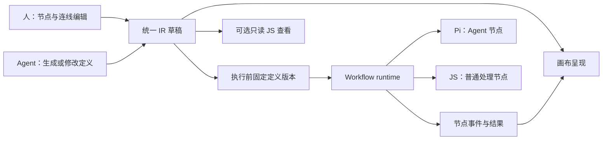

# Dynamic Workflow Workbench — 产品与技术设计 v3

更新：2026-09-20。当前原型设计，替代 [归档 v2](<./archive/Dynamic Workflow Workbench — 产品与技术设计 v2.md>)。这是目标设计；现有代码只有组件接入实验，新 IR、画布编辑与 runtime 尚未实现。

## 1. 产品与范围

用户提供目标与材料，Agent 形成一套做法；用户在节点画布上理解和调整做法，运行后查看结果，用少量真实样本试验修改，再采用满意的方法与产物。

原型优先可用、用户友好、实现简单。充分复用现成组件与 Pi，让应用代码集中在工作流语义及业务闭环。用户不需要写 JS，coding agent 可以直接理解节点定义与对应实现。

安全、权限、隔离、多租户、生产治理不在范围内。设计中的节点/端口检查用于让流程正确运行，不扩展成安全或治理平台。

## 2. 核心决定：一份定义，画布编辑，runtime 执行

IR 是受约束的 JS 语义子集，用显式节点、参数和连接表达调用、顺序、条件分流与有限集合迭代。它可用 JS 模块中的声明式对象表示，由应用 runtime 按这些有限语义执行。



- Canvas、节点配置和 Agent 都修改同一份定义。画布节点使用 IR 的稳定 `nodeId`。
- JS 是 IR 的一种可读表示，不维护一份独立的、可以任意编辑的协调程序。
- Node.js 加载定义，应用 runtime 调度节点；普通处理节点执行已有 JS 函数，Agent 节点交给 Pi。不是把画布 JSON 丢给 JS 引擎就能自动执行。
- 不从任意 JS 源码反推图，不做任意 JS 与画布双向转换，不需要 Program Analyzer、Babel/recast 或源码位置索引。
- 原型只支持应用生成的有限定义结构；不提供任意 JS 文件导入功能。这里的“子集”限定工作流表达能力，不承诺代码隔离。

## 3. 最小工作流定义

定义只保留：版本格式、输入、节点、连接、输出。节点布局坐标另存为视图数据，移动节点不改变执行语义。

| 项目 | 含义 |
| --- | --- |
| Node | 稳定 ID、类型、名称、任务/参数、执行模式 |
| Edge | 明确的来源节点/输出端口与目标节点/输入端口 |
| Inputs / Outputs | 本次工作流或局部试运行的输入输出 |
| View state | 节点位置、缩放、展开状态；不参与调度 |

先支持少量节点能力：

- **Agent**：任务说明、输入、需要的结果结构，交给 Pi 执行。
- **Function**：调用已注册的 JS 处理函数，用于读取、转换、合并等普通处理；不先建设面向用户的代码编辑器。
- **Branch**：有限字段条件，将输入分到明确的输出端口；不引入任意 JS 表达式语言。
- **逐项模式**：Agent/Function 节点可对有限输入集合逐项执行并汇总结果，不必为每个样本复制节点定义。

顺序与依赖来自连线。第一版普通连线不允许环；循环需求限于集合逐项处理。自由回连、无限循环、递归子流程不在第一版范围。

以下只说明定义形状，字段名待下一轮最小 runtime 实验固化，并非已实现 API：

```js
export default {
  schemaVersion: 1,
  id: "feedback-analysis",
  inputs: ["feedback"],
  nodes: [
    {
      id: "classify",
      kind: "agent",
      label: "分类反馈",
      mode: "each",
      task: "区分问题、需求与称赞；给出依据。",
    },
    {
      id: "report",
      kind: "agent",
      label: "形成建议",
      mode: "all",
      task: "根据分类结果整理建议，保留原始反馈引用。",
    },
  ],
  edges: [
    { from: ["$input", "feedback"], to: ["classify", "input"] },
    { from: ["classify", "output"], to: ["report", "input"] },
  ],
  outputs: { report: ["report", "output"] },
};
```

示例的 JS 表示只需字面量、对象、数组与固定模块导出。保存/载入围绕这份定义，视图修改通过对象更新与确定性序列化完成；不建立另一套生成代码/反向解析同步链。

节点内部可以有复杂 Agent 工作，但只有用户需要单独控制的步骤才拆成画布节点。Agent 的搜索、阅读等工具调用先作为执行记录查看。

## 4. runtime 的最小职责

1. 检查节点 ID、已知类型、端口引用、必要配置和不支持的环；错误定位到节点或连接。
2. 接收固定版本的定义、真实输入与本次运行范围。输入依赖就绪后调用节点处理器。
3. `each` 为每个输入项生成独立执行实例并按输入顺序收集结果；`all` 一次处理完整输入。先顺序执行，不预建复杂并发调度。
4. Branch 按条件分流，输出明确的匹配/不匹配集合；空集合也是已完成输出。下游逐项节点对空集合产生空结果，不等待不存在的实例。汇合由明确的输入端口和合并处理器完成。
5. 记录节点的运行、完成、失败、取消事件与输入输出；停止运行时中止活跃 Pi 调用并停止后续调度。
6. 节点失败时阻止依赖其成功输出的后续步骤，保留已完成结果供检查和显式复用。支持选中失败输入重新试，不自动重做整件工作。

每条执行记录最少关联 `runId + definitionVersion + nodeId + instanceId`；逐项实例还关联稳定的输入项 ID。源码路径、AST 路径、行号不是业务身份。

定义图和运行实例分开：“调查主题”保持一个节点，运行中显示 `已完成 3 / 共 12`，展开后查看 12 个实例。Agent 修改图结构形成候选定义，不偷偷改写正在执行的版本。

先复用 Pi 的 Agent loop、工具与取消，以及普通 JS 函数。剩余节点依赖与结果关联用薄适配实现；不重建通用 JS 解释器或编译器。若最小实验发现这些语义需要大量框架代码，应先缩减支持范围或评估现有 runtime，而不是扩建平台。

## 5. 人如何操作

画布是主要工作流编辑界面，节点体现业务职责与状态，连接体现数据去向与条件。用户可以添加/删除/移动节点、连接端口、修改节点任务与参数，也可以选中节点向 Assistant 提出修改。

画布选中对象、节点配置、执行结果、Assistant 共享同一上下文。不沿用实验中“工作区 / Method 与比较 / Assistant”三个相互切断的页面。

| 场景 | 主要呈现与动作 |
| --- | --- |
| 理解或修改做法 | 画布、节点配置、节点增删与连接变化 |
| 检查节点 | 输入、实际结果、失败原因；必要时展开工具记录 |
| 选样本试运行 | 在材料/实例列表多选，显示本轮固定的节点与样本范围 |
| 评估候选 | 同一样本的结果对比，以及哪些节点/参数/连接改变 |
| 采用改进 | 分别采用工作流定义与保留所选结果 |
| 查看实现 | 可选只读 JS；不是完成上述操作的前提 |

列表用于材料、结果和执行实例，不替代工作流画布。比较时可以让样本结果占据更多空间，并保持选中的节点上下文。代码 Diff、源码标签页和 JSON 调试面板不成为默认工作内容。

## 6. 样本试验、版本与结果

保留最少必要对象：Work（目标与材料）、DefinitionVersion（定义版本）、Run（一次运行，可为样本试验）、NodeResult（节点实例产物）。候选是一个可编辑草稿；修改说明作为草稿/运行的元数据，不拆出 Correction 或独立 Spike 平台。

- 试运行针对一个节点或显式选定的连通片段，并固定样本输入。第一步先支持单节点试运行；片段执行在同一输入规则下按需增加。
- 缺少输入时让用户选择已有产物、提供材料或执行所需上游；不尝试恢复任意代码的闭包和调用栈。
- 当前定义与候选用同一组冻结输入比较。优先比较结果，结构变化以节点、连接与参数差异展示。
- 草稿修改后标记旧比较为“需重新试运行”，不把旧结果冒充新候选结果。
- 执行固定某版定义；采用候选影响后续运行，不重写历史记录。
- 采用定义与保留结果是独立动作。新一次运行可以把用户选定的旧/新产物作为显式输入，并保留其来源。
- 续做是用指定输入发起新运行。第一版不做隐式缓存命中、自动依赖失效、自动拼接整个历史运行或任意断点恢复。

## 7. 简单工程组织与持久化

一个 React/Vite 前端，一个 Node/Hono 后端；HTTP 操作与 SSE 状态更新。按 IR、runtime、Pi 适配、画布、节点面板、Assistant 划分少量模块，不预拆 monorepo 多包。

第一版使用本地文件：目标与材料索引、IR 草稿/版本、运行元数据、结果文件和追加事件记录。保留清楚的 ID 关联即可；不同时维护文件与数据库两套权威状态。SQLite 留到确有查询需求时再评估。

IR 的 JS 文件由应用从定义对象确定性保存；读取后取得同样定义对象。运行前保存版本快照，草稿不覆盖历史版本。画布布局单独保存，JS 查看直接展示当前定义的序列化结果。

作者会话用于生成/修改 IR，执行会话用于完成 Agent 节点；样本试验复用相同节点执行路径，不再设计第三套 Spike 会话机制。业务状态保存到 Work 文件，而非只存在于聊天历史中。

## 8. 技术复用与范围裁剪

| 保留或采用方向 | 用途 |
| --- | --- |
| React、TypeScript、Vite | 已试接的应用工具链 |
| React Flow | 主要画布；节点与连接映射 IR。编辑同步/端口校验尚需验证 |
| shadcn/ui、Radix、Tailwind、Lucide | 基础控件；重新设计产品视觉，不沿用 Spike 外观 |
| assistant-ui + Pi SDK | 自然语言编辑、Agent 节点执行；不重建 Agent loop |
| Hono + SSE | 操作与运行事件 |
| react-resizable-panels | 有需要时调整画布/检查面板空间 |
| TanStack Table、Markdown | 样本/结果与报告；按实际内容使用 |

| 从当前产品范围移除 | 原因 / 替代 |
| --- | --- |
| 人类必用的 Monaco、代码 Diff、源码编辑流程 | 人编辑画布/配置；改动看节点和参数变化 |
| Program Analyzer、Babel/recast、AST/source range/siteId 索引 | IR 直接提供结构与稳定 nodeId |
| 任意 JS ↔ 任意画布转换与独立 Semantic Graph 同步 | 一份定义，多种视图 |
| 树/IDE Outline 作为主要流程表达 | 主工作流使用节点画布；列表只承担材料和实例浏览 |
| 通用代码片段执行、闭包捕获、调用栈恢复 | 明确节点输入，显式发起新的局部运行 |
| 单独 Spike/Correction 子系统与多套 worker 路径 | 试验是带样本范围的 Run，反馈作为修改元数据 |
| 通用自动缓存/失效/复杂调度/事件回放引擎 | 顺序运行、显式复用输入、保存结果；按真实问题扩展 |
| 任意嵌套子流程、无限循环、节点市场、自动布局平台 | 先以少量节点、有限逐项处理和基本画布交互完成工作 |
| 自由停靠工作台、固定多栏、全套语义缩放 | 画布与上下文面板，按任务分配空间 |

移除的是正式产品要求。已有 component-spike 的源码编辑、树等例子与依赖作为历史接入证据保留，不复制到新产品主路径，也不把旧测试误报为新架构验证。

## 9. 首个闭环与后续验证顺序

产品验收先围绕 [分类用户故事（讨论稿）](./user-stories.md) 讨论范围；以下是技术验证顺序，不代替用户故事验收。

首个场景使用 3 条客户反馈：Agent 给出分类/汇总流程；用户在画布修改分类要求；选中样本运行；查看结果；再修改一个节点并比较；分别采用定义与保留结果；用选定结果生成最终报告。

先完成一个代表性画布页面的真实参考研究与视觉讨论；已有 Spike 的样式、配色和组件组合已被用户否定。技术测试通过不等于视觉验收。

下一轮只验证这一条技术闭环：

1. 同一份最小 JS 子集 IR 能载入、保存并稳定映射画布节点/连接。
2. 拖拽连线与配置修改更新 IR，runtime 下一次执行确实跟随新定义；移动坐标不改执行结果。
3. 两个 Agent/Function 节点与有限逐项模式真实执行，事件能定位节点和样本。
4. 加入一个最小条件分流样例，验证空分支和汇合输入语义。
5. 选中单节点，用相同输入比较候选，展示结构变化与结果变化；分别采用定义和产物。
6. 保存并重新打开，定义、布局、结果与来源仍能对应；真实模型验证与 fixture 证据分别标注。

下一轮结果决定字段与 runtime 边界，不提前增加编译器、任意表达式系统或新的执行平台。

## 10. 文档与证据

- [文档入口](./README.md)、[原稿归档与摘要](./archive/README.md)。
- [产品摘要](../conductor/product.md)、[交互指南](../conductor/product-guidelines.md)、[技术状态](../conductor/tech-stack.md)、[组件职责](../conductor/component-options.md)。
- [历史组件 Spike](../conductor/tracks/component-integration-spike_20260919/results.md)：保留真实包接入证据，已被替代的架构建议不继续生效。
