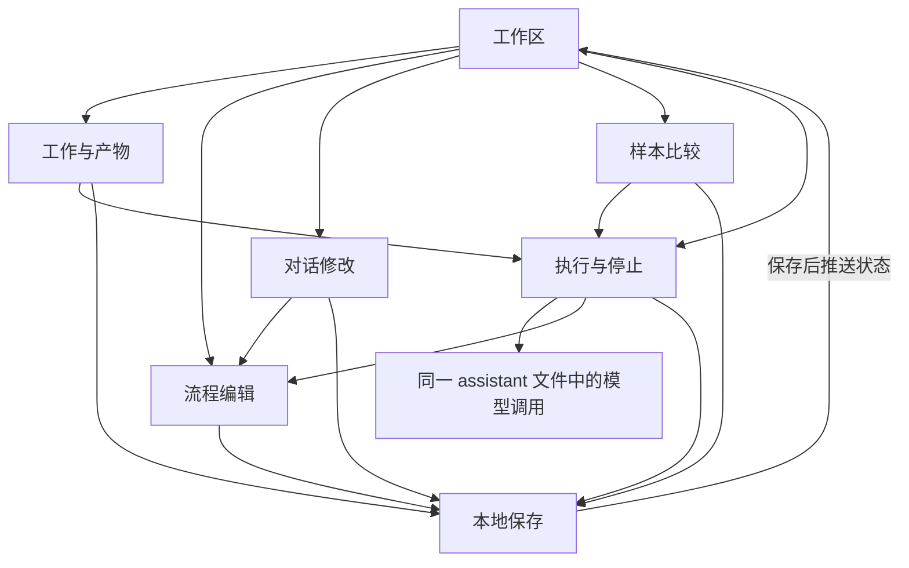

# 功能接口（伪代码约定，不是稳定 SDK）

只把当前模块必须交接的信息说明白。无需先定复杂 REST 规范、命令系统或通用 DTO 基类。后端用 Hono 暴露下表的具体操作，文件间直接调用。

共同约定：成功返回实际保存后的 ID/状态；失败返回 `{message, nodeId?, field?, nextAction?}` 供局部呈现。异步操作返回任务所属 ID，后续状态从同一工作订阅；HTTP 处理器不等待整轮模型执行。

| 调用方 → 函数 | 输入 | 输出 / 完成效果 |
| --- | --- | --- |
| client → work.createWork | 目标、确认拆分后的文本 | workId；失败保留表单 |
| client → work.addMaterials | workId、新文本 | 新材料 ID；旧材料不改 |
| client → work.readWork | workId | 保存状态与相关定义、运行、结果、比较 |
| client → flow.beginCandidate | workId、用户选定 baseDefinitionId、expectedDraftId、是否确认替换已有草稿 | 明确候选及比较起点；有冲突时说明而不覆盖 |
| client / assistant → flow.saveDraft | workId、expectedDraftId、完整下一版定义 | 新 draftId、节点变化、局部配置问题；冲突不覆盖 |
| client → flow.saveLayout | workId、坐标、缩放 | 已保存视图；定义 ID 不变 |
| client → assistant.requestEdit | workId、选中节点或全流程范围、消息、样本 | 请求/消息 ID；流式回复；工具实际保存结果 |
| client → runs.start | workId、明确 definitionId、full 或单节点 scope、Inputs | runId；保存 queued 后后台执行 |
| client → runs.stop | workId、runId | stopping 或原终态，稍后变 cancelled |
| client → runs.retry | workId、oldRunId、failedResultId、所选 definitionId | 新 runId；使用原失败输入快照 |
| client → trials.compare | workId、baselineId、candidateId、nodeId、明确输入 | comparisonId；两侧顺序产生 Run |
| client → trials.readComparison | workId、comparisonId、当前基线 ID 与输入选择 | 对齐结果、每侧状态、结构变化、是否过期 |
| client → trials.stopComparison | workId、comparisonId | 停止本侧且不再启动下一侧 |
| client → flow.adopt / discardDraft | workId、要采用的 definitionId / 仅 workId | 更新采用指针 / 回到采用版；保留历史 |
| client → work.keepResults | workId、所选成功结果 ID | 已保留结果清单；不采用定义 |
| client → work.continueWithResults | workId、definitionId、目标节点、所选结果 ID、确认 | 确认前给输入预览与冲突；确认后新 runId |
| client → work.report | workId、runId、outputName | 正文、来源、范围、完整性 |
| client → files.subscribeWork | workId | SSE 首次/重连完整状态，随后推送已保存状态 |
| runs → assistant.executeNode | 任务、预期输出、Inputs、固定运行/节点/实例身份、停止信号、活动回调 | 实际输出、工具记录；取消/错误独立返回 |
| flow / work / runs / trials / assistant → files.change | workId、一个具体的小修改 | 按顺序持久化成功后的状态；失败不推进成功状态 |

`flow.checkDefinition / validateForRun`、`files.writeNewDefinition / openWork / onServerStart` 与 `runs.startComparisonSide` 为内部函数，见各文件。没有单独的“试验 runtime”，没有“读取最新结果自动续做”的接口。

## 最少调用关系

requestEdit 与 executeNode 同处一个模型调用文件，但节点执行不会反过来自动编辑正在运行的图。这个区分只是两个实际函数，不是两套 Agent 框架。

完整的 [Pi 角色、tool call → Canvas 链路及内部/外部依赖](./pi-canvas-dependencies.md) 是本表的补充。工具使用 SDK 的 customTools 接入，业务更新通过同一 saveDraft，不增加通用工具平台。
