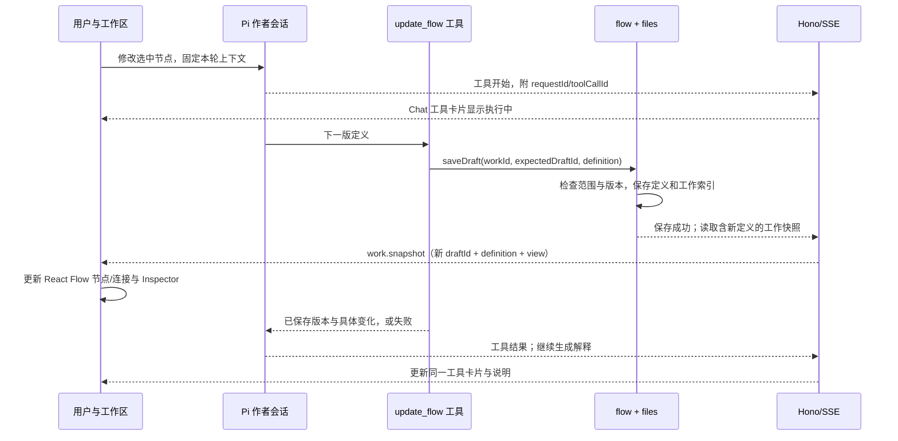

# Pi、工具调用、画布同步与模块依赖

这是对现有伪代码的补充，仍然不是可执行实现。先说明三个问题：Pi 做什么；Agent 的动作在哪里可见；每个功能文件依赖什么。

## 1. Pi 是实际 Agent 执行部分

| 工作 | 由谁完成 | Pi 的位置 |
| --- | --- | --- |
| 根据目标生成流程、根据反馈修改流程 | assistant.requestEdit | 创建/使用 Pi AgentSession，提供当前工作上下文和应用工具，Pi 进行模型调用、工具执行与后续回复 |
| 执行一个 Agent 节点 | assistant.executeNode | 使用 Pi AgentSession 完成当前节点任务，流式返回内容、工具活动、最终输出；普通文本任务不必强制调用工具 |
| 跑完整流程、逐项/分支/汇合、固定版本和输入 | runs | 应用的少量顺序调度代码；遇到 Agent 节点才调用上面的 executeNode |
| 画布交互、Chat 展示 | React Flow、assistant-ui | Pi 在后端，前端显示应用转发的消息、工具和业务状态 |
| 定义保存、版本关联、样本比较 | flow/files/trials | 属于本产品的功能；Pi 不替产品决定采用哪个版本、哪些结果进入报告 |

Pi 的模型调用与工具循环复用 SDK，不再写自己的 Agent loop。作者会话和节点执行会话是不同用途的会话，复用同一套 SDK 与模型配置，不建设两套 Agent 框架。任务与输入已经足够的 Agent 节点可以直接输出；将来确有读取外部材料等需求时才增加对应业务工具。

本地代码可核对的事实：旧实验 [pi-session.ts](../examples/component-spike/pi-session.ts) 已使用 `createAgentSession`、`defineTool`、`session.subscribe`、`session.prompt`、`session.abort`，并注册 `inspect_sample`。其模型响应来自 faux provider；它没有实现下面的 update_flow，也没有证明 Agent 修改图的链路已经跑通。安装的 SDK 类型声明包含 `customTools`、订阅和取消接口；新工具仍需实际接入。

## 2. 应用只需要少量明确工具

下列是本应用拟注册的工具，不是声称 Pi 自带这些工具。沿用当前 customTools 接入方式，工具函数直接调用现有业务文件。

| 工具 / 使用位置 | 模型提供的参数 | 服务器固定的上下文 | 实际效果 |
| --- | --- | --- | --- |
| `update_flow` / 作者会话 | 完整下一版 definition、简短修改说明 | workId、请求起点 expectedDraftId、选中节点或全流程范围 | 调用 flow.saveDraft，保存候选草稿；不自动采用 |
| `inspect_result` / 作者会话 | runId、resultId | workId | 从 files.openWork 读取指定输入、输出和错误，供模型分析具体问题 |
| 节点任务所需工具 / 执行会话 | 由该工具具体功能决定 | runId、definitionId、nodeId、instanceId | 供该节点完成任务；活动显示在所属节点记录，不自动增添画布步骤 |

初始目标、材料、当前草稿直接作为上下文提供，不为了读这几个字段再造一套通用查询工具。`update_flow` 是之前伪代码中 proposeFlow 的明确名称：它会实际更新候选，不只是生成一段描述。完整定义适合当前小流程，暂不建设通用 patch DSL。

画布同步依赖实际调用业务函数，不监听任意磁盘修改。即便以后使用 Pi 的文件编辑工具，直接改文件也不能自动声称画布已同步；当前用户故事使用 update_flow 即可，不需要文件观察器或源码分析器。

## 3. Tool call 怎样让画布改变

**画布不等待最后一段自然语言回复，也不从回复文本提取“修改”。** 保存成功的工作快照才是结构更新依据。`tool.completed` 只更新工具卡片和变更说明，不能单独驱动画布换版本。消息与快照不必到达顺序完全相同；缺快照时显示“已保存，正在同步”，重取当前工作，不假装画布已经更新。

版本冲突、输出形状错误或保存失败时不产生新成功快照，旧画布保留，工具卡片显示原因。手动编辑与 Agent 编辑最终调用同一个 saveDraft，前端使用同一更新方式。

### 执行中的 tool call 不等于修改流程

| 事件 | 携带的关联信息 | 前端反馈 |
| --- | --- | --- |
| 作者文字、工具开始/结果 | workId、requestId、toolCallId、toolName、args/result/error | Chat 中的文字或同一工具卡片；不能把所有工具名写死为 inspect_sample |
| 节点工具开始/进度/结果 | workId、runId、definitionId、nodeId、instanceId，加 toolCallId | 对应运行图的节点显示活动；Inspector 展开具体实例和工具记录 |
| 节点完成/失败/取消 | 上述节点与运行身份、实际状态与产物 | 运行进度、样本结果、错误与停止状态 |
| 工作保存成功 | workId、最新草稿/采用定义、运行状态、view | 同步业务内容；保留本地视口、选中和未提交输入 |

这些身份由服务端在会话创建时绑定，不让模型猜 nodeId。不同会话即使 toolCallId 相同，也按 requestId 或 runId + instanceId 区分。节点内部的搜索/读取等工具活动不自动变成新画布节点。

运行图始终使用 `run.definitionId`：在草稿中删除一个旧节点，也不能把旧运行事件错挂到另一个节点。检查旧运行时显示该版图；编辑候选时显示候选图并保留“正在查看哪个版本”的标签。

已有节点位置保持不变；新增节点先放到可见空位，必要时供用户拖动；删除所选节点后清空对应选择并提示，不保留悬空 Inspector。普通状态更新不自动 fitView。首版不因此引入自动布局库。

## 4. 内部功能依赖

箭头代表直接调用或使用，不代表要新增一层抽象。

| 文件/入口 | 内部依赖 | 为什么需要 |
| --- | --- | --- |
| client/workspace | 服务端公开的 work/flow/runs/assistant/trials 操作；工作状态与消息订阅；shared 记录 | 界面动作与同一业务状态衔接；不直接 import 服务端执行代码 |
| server 入口 | work、flow、runs、assistant、trials、files | HTTP 路由、SSE 连接、启动恢复；将保存通知与会话消息写到连接 |
| work | files、runs | 保存材料/选择；用指定结果发起新运行 |
| flow | files | 保存草稿/视图/采用指针；校验与比较是本地函数 |
| runs | flow、assistant、files | 运行前校验，调用 Agent，保存执行结果 |
| assistant | flow、files | 工具写草稿、读具体结果和保存消息；不调用 runs 来调度整条图 |
| trials | runs、files | 顺序执行两边并保存比较关系 |
| files | 无其它业务模块 | 本地文件读写和已保存状态通知；不依赖 Pi 或 UI |
| shared | 无业务模块 | 普通记录类型；需要的文件直接引用 |

inspect_result 直接读 files，不调用 work，避免产生 `work → runs → assistant → work` 的循环依赖。SSE 由现有 server 入口承接；files 只通知“工作已保存”，由入口取得完整定义并发送快照，不把 Hono 或 React 引入文件读写模块。

## 5. 各模块的核心外部依赖

包名来自当前 package.json；这里只确定负责使用它的功能，不因为旧实验安装过就全部用于产品。

| 功能位置 | 核心外部依赖 | 负责什么 / 哪些仍由应用写 |
| --- | --- | --- |
| 前端入口、Workspace | `react`、`react-dom`；Vite/TypeScript 为构建工具 | 组件和状态组合；工作选择与版本语义由应用处理 |
| WorkflowCanvas | `@xyflow/react` | 拖拽、连线、缩放；IR 映射、连线有效性与状态对应由应用处理 |
| Assistant UI | `@assistant-ui/react`、`@assistant-ui/react-markdown` | 对话和消息呈现；Pi 事件转消息、工具卡片与画布同步由应用处理 |
| Inspector/操作控件 | shadcn 生成的本地组件、`radix-ui`、`tailwindcss`、`lucide-react` | 控件行为和样式能力；产品布局、视觉变量与动作含义由应用设计 |
| 样本/报告/比较 | `react-markdown`；多列表格需要时用 `@tanstack/react-table` | 内容渲染与表格机制；样本绑定、比较和采用由应用处理 |
| 调整面板尺寸 | `react-resizable-panels`，按需 | 分栏拖拽；不作为必须同时展示多栏的理由 |
| server 入口 | `hono`、`@hono/node-server`，SSE 使用 Hono 能力 | HTTP/SSE；不另加 WebSocket 或事件总线库 |
| assistant | `@earendil-works/pi-coding-agent`、`@earendil-works/pi-ai` | AgentSession、应用工具、模型/协议调用、流式事件、取消；应用补上下文与事件关联 |
| work、flow、runs、trials | 无额外核心第三方运行库 | 普通 TypeScript 函数；runs 的 LLM 能力经 assistant 使用 Pi，不再引入第二个 Agent 框架 |
| files | Node 内置 `fs/promises`、`path` 等 | 本地保存与恢复；不引入 ORM/数据库/Repository 库 |
| shared | TypeScript 类型能力 | 无运行时 schema 平台 |
| 自动测试（未来实现） | `node:test` + `tsx`、`@playwright/test` | 业务与浏览器测试；真实模型验证另留证据 |

Monaco、React Arborist、独立代码 Diff、AST 工具不进入此链路。当前依赖已安装并不意味着所有协议、工具→画布同步和新 runtime 已验证。

## 6. 新补充的验收点

- P29：Pi 实际调用 update_flow，最终文字尚未输出时，画布和 Inspector 已按保存定义更新；保存失败/草稿冲突时不更新。
- P30：逐项实例产生工具活动，正确显示到对应节点/样本，重名 toolCallId 不串会话；不增加假的流程节点，不改运行版本。
- P31：快照带上实际定义内容；先到工具结果、后到快照或重连时仍能同步；已有位置与选择保持，删除选中节点时正确清理。

三项都需要后续真实 SDK/服务端/浏览器联测。目前只有伪代码与测试设计，没有把既有 inspect_sample 演示当成这些新能力的证据。
